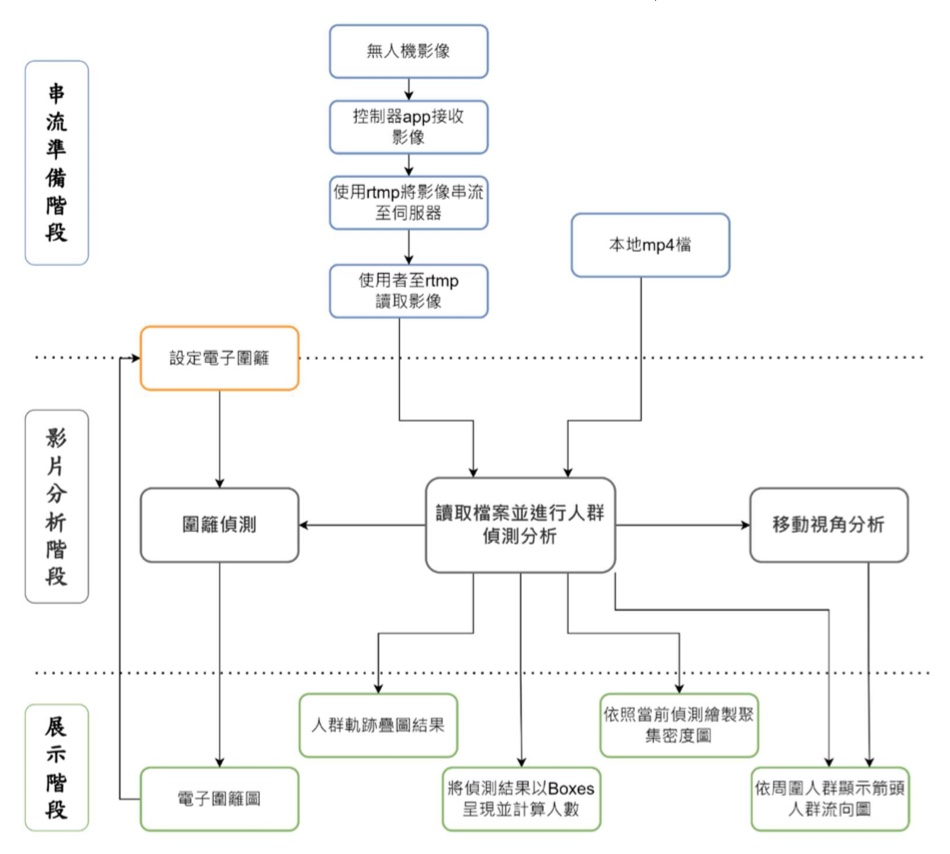

# 走出智在的路 Walk in Intelligent Way

[介紹簡報(動圖)](https://docs.google.com/presentation/d/1P2b_x1jzmzc5eHzIuQAWc_UVDr3WJHgptRQxmGB8zEE/edit?usp=sharing)

[An Aerial Crowd-Flow Analyzing System for Drone Under YOLOv5 and StrongSort（CACS 2022發表）](https://ieeexplore.ieee.org/document/9969785)

[專題報告書](https://drive.google.com/file/d/1jk6EZENE2BGotLCzguaTS-wP52zOplmd/view?usp=share_link)

## 動機
近年來，隨著無人機的快速發展，使用電腦視覺與無人機進行環境監測已逐漸成為主流研究。相較於固定攝影機而言，利用無人機可有較大的拍攝視野與較高機動性，因此針對特定環境的監測扮演關鍵的角色。特別是在疫情時代中，**影像辨識物件技術的進步大幅地改進人流分析系統。透過人流分析，可以更有效的管控人群並設計人流動線**;例如在大型活動、人數眾多的場所，只要人流動線設計不佳，經常造成擁擠、堵塞的狀況，嚴重甚至會影響公共安全。然而，現行的系統會因為攝影機高度、解析度等環境限制，使得在高空難以偵測到較小的人像。因此，運用深度學習和電腦視覺的模型加強訓練，加以對識別較小人像，並進行影像分析。

為了改善特定區域內的人流，如何偵測人群軌跡以及事先了解人群分布是很重要的課題。而人流分析系統具有顯示人流動向與熱區等功能。這些功能剛好可以用於解決人群動向的問題。此外，利用無人機空拍來偵測各大範圍的人群，藉此獲得更好的數據以追蹤人流、規劃逃生動線並維護公眾安全。

## 簡介

我們提出了一個基於深度學習的人流分析系統(Figure 1.1)，其使用 YOLOv5 和 StrongSORT with OSNet 來檢測和分析獲得的數據，如人群追蹤 和繪製(圖 1a)**人流軌跡圖**、(圖 1b)**人群流向圖**、(圖 1c)**聚集密度圖**、(圖 1d)**人數統計**和(圖 1e)**電子圍籬**，並以網頁呈現(Figure 1.2)， 其中*人群流向圖可以針對移動視角所造成的偏差進行修正*。另外，此系統 也可以搭配無人機串流影像，彌補了攝影機架設位置的限制。
<div align="center">
<p>
 
</p>
<p>

</p>
</div>
<!-- This repository contains a highly configurable two-stage-tracker that adjusts to different deployment scenarios. The detections generated by [YOLOv5](https://github.com/ultralytics/yolov5), a family of object detection architectures and models pretrained on the COCO dataset, are passed to [StrongSORT](https://github.com/dyhBUPT/StrongSORT)[](https://arxiv.org/pdf/2202.13514.pdf) which combines motion and appearance information based on [OSNet](https://github.com/KaiyangZhou/deep-person-reid)[](https://arxiv.org/abs/1905.00953) in order to tracks the objects. It can track any object that your Yolov5 model was trained to detect. -->

## 功能

### 1. 人群流向圖

 

### 2. 移動視角下對流向修正

| before | after |
| ------- | ----- |
| | |

### 3. 聚集密度圖

 

### 4. 人流軌跡圖

 

### 5. 人數統計並Boxing

 

<br>
<div>
<!-- <a href="https://github.com/mikel-brostrom/Yolov5_DeepSort_Pytorch/actions"></a> -->
<br>  
<!-- <a href="https://colab.research.google.com/drive/18nIqkBr68TkK8dHdarxTco6svHUJGggY?usp=sharing"></a> -->
 
</div>

</div>

## Tutorials

* [Yolov5 training (link to external repository)](https://github.com/ultralytics/yolov5/wiki/Train-Custom-Data)&nbsp;
* [Deep appearance descriptor training (link to external repository)](https://kaiyangzhou.github.io/deep-person-reid/user_guide.html)&nbsp;
* [Yolov5 StrongSORT OSNet evaluation](https://github.com/mikel-brostrom/Yolov5_StrongSORT_OSNet/wiki/Evaluation)&nbsp;
* [StrongSORT ablation study](https://github.com/mikel-brostrom/Yolov5_StrongSORT_OSNet/wiki/Yolov5DeepSORTwithOSNet-vs-Yolov5StrongSORTwithOSNet-ablation-study-on-MOT16)&nbsp;


## 使用方法

1. Clone the repository recursively:

`git clone --recurse-submodules https://github.com/markhsumark/WalkInIntelligentWay.git`

If you already cloned and forgot to use `--recurse-submodules` you can run `git submodule update --init`

2. Make sure that you fulfill all the requirements: Python 3.8 or later with all [requirements.txt](https://github.com/mikel-brostrom/Yolov5_DeepSort_Pytorch/blob/master/requirements.txt) dependencies installed, including torch>=1.7. To install, run:

`pip install -r requirements.txt`

3. 使用功能之指令

```bash
$ python track.py --source /path/to/video.mp4
```

若不需要移動視角修正
```bash
$ python track.py --source /path/to/video.mp4 --show-optflow
```
逐幀影像檢視
```bash
$ python track.py --source /path/to/video.mp4 --wait
```


## Cite

If you find this project useful in your research, please consider cite:
```latex
本專案開發產品授權條款使用 MIT 授權條款授權條款宣告。
Copyright <2022> <現在要成發>
Permission is hereby granted, free of charge, to any person obtaining a copy of this software and associated documentation files (the "Software"), to deal in the Software without restriction, including without limitation the rights to use, copy, modify, merge, publish, distribute, sublicense, and/or sell copies of the Software, and to permit persons to whom the Software is furnished to do so, subject to the following conditions:
The above copyright notice and this permission notice shall be included in all copies or substantial portions of the Software.
THE SOFTWARE IS PROVIDED "AS IS", WITHOUT WARRANTY OF ANY KIND, EXPRESS OR IMPLIED, INCLUDING BUT NOT LIMITED TO THE WARRANTIES OF MERCHANTABILITY, FITNESS FOR A PARTICULAR PURPOSE AND NONINFRINGEMENT. IN NO EVENT SHALL THE
AUTHORS OR COPYRIGHT HOLDERS BE LIABLE FOR ANY CLAIM, DAMAGES OR OTHER LIABILITY, WHETHER IN AN ACTION OF CONTRACT, TORT OR OTHERWISE, ARISING FROM, OUT OF OR IN CONNECTION WITH THE SOFTWARE OR THE USE OR OTHER DEALINGS IN THE SOFTWARE.
```

```latex
@misc{yolov5-strongsort-osnet-2022,
    title={Real-time multi-camera multi-object tracker using YOLOv5 and StrongSORT with OSNet},
    author={Mikel Broström},
    howpublished = {\url{https://github.com/mikel-brostrom/Yolov5_StrongSORT_OSNet}},
    year={2022}
}
```
 
## 作者

徐易中 tulsa0415@gmail.com
葉冠昊 yeskey525@gmail.com
陳冠宇 a0973471825@gmail.com
周雅蓁 jcohaonuna@gmail.com
 
